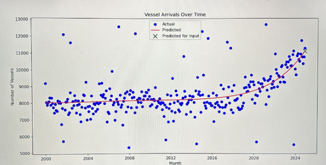
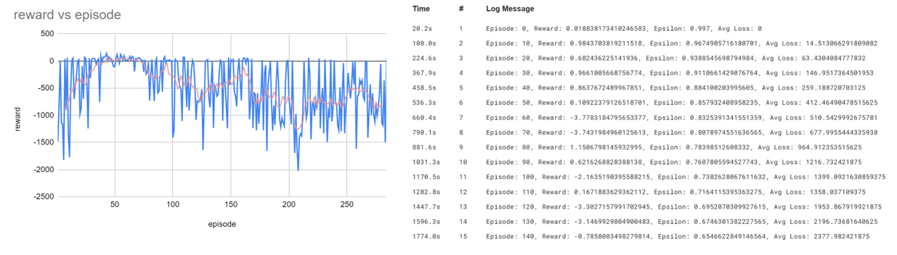
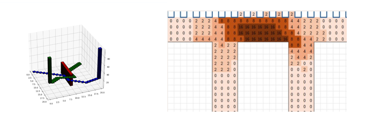
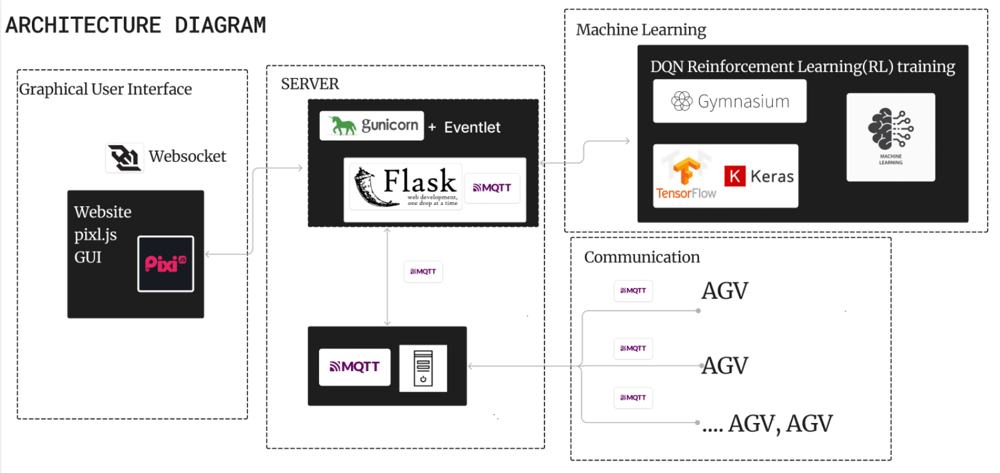

# 2024 PSA Code Sprint Hackathon CHAMPIONS
## Overview
By: Team Teletubbies

In this project, we developed an AI-driven solution aimed at improving sustainability and operational efficiency in port operations, with a focus on Automated Guided Vehicles (AGVs). The solution was designed for PSA Code Sprint 2024 under **Theme 2: Efficient & Green Supply Chains**.

Our solution sought to address these inefficiencies by implementing AI-driven systems that optimize AGV energy use, route planning, and prioritization of cargo handling, thus helping PSA move toward their goal of 50% emission reduction by 2030.

Our solution sought to address these inefficiencies by implementing a **mixed integer AI-driven systems** that optimise AGV energy use, route planning, and prioritisation of cargo handling. 

### Key Features: 
#### AI Driven Energy Management:
We developed a **polynomial regression model** to forecast future cargo demand, enabling AGVs to:
- Adjust speed during low-demand periods.
- Deactivate when idle
- Charge at optimal times to redice unnecessary energy use.

This results in a 3.37% reduction in AGV emissions. 

#### Adaptive Prioritization:
Our solution uses a **Reinforcement Learning Deep Q-Network Model** to dynamically prioritize the loading and unloading of cargo based on:
- Time sensitivity (urgent or perishable goods).
- Departure deadlines.
- Customer requirements (special handling).

This ensures AGVs handle containers efficiently, reducing both delays and energy consumption.


#### Dynamic Routing
We integrated a **custom 3D A Star pathfinding algorithm** and a Deep Q-Network (DQN) model to dynamically adjust AGV routes in real-time, avoiding high-traffic zones and minimizing delays.

By considering time as a third dimension, our routing system reduces congestion and optimizes the flow of AGVs across the port.


## Technology Architecture


## Tech Stack
- DQN Reinforcement Learning Model
- Polynomial Regression Model
- 3D-A Star Model Algorithm (x/y/time)
- Gunicorn+Eventlet/Flask (Web Server)
- Websocket+MQTT (Communications)

To run this project please have these neccessary items:

## Download Ubuntu
Due to the use of gunicorn, this project can only be ran on Ubuntu (WSL works) or any other UNIX system. 

Our prototyping **only used wsl Ubuntu22.04.03** found on the Windows Microsoft Store. Though other UNIX systems such as macOS and other Linux distributions will work in theory but they have not been tested and **may not work**.

## Download Python3.7
Due to the use of `amqtt` to facillitate communication between AGVs using the MQTT protocol, only python3.7 is supported. (This is because Python 3.8 changed the semantics of asyncio.CancelledError)

Some users will not be able to install python3.7 from a tarball, hence the following method via deadsnake ppa is prefered

```bash
$ sudo apt install software-properties-common
$ sudo add-apt-repository ppa:deadsnakes/ppa
$ sudo apt update
$ sudo apt install python3.7
$ python3.7 -V
Python 3.7.7
```

## Set up Virtual Environment (Optional)
This step is optional but is highly reccomended, especially if you already have another python version on your device.

```bash
$ cd codeSprint
$ sudo apt-get install python3.7-venv
$ python3.7 -m venv .env 
$ source .env/bin/activate
```

## Install Libraries
Install the neccessary libraries in `requirements.txt`.

Due to the length of `requirements.txt`, we find that installing these libraries through pip may miss out on some of the libraries. We highly suggest to run it a few more times if you encounter `ModuleNotFound` errors.

```bash
pip install -r requirements.txt
```

## Run the project
The project is comprised of these different code that has to run concurrently.
1. MQTT Server
2. Gunicorn WSGI Server
3. Web Application*
4. MQTT client(s)*

\* These code can have multiple isntances of it running concurrently

Please run all of them in these order

### MQTT Server
The MQTT server facilitates conversations between the AGVs and the central Gunicorn WSGI Server to transfer information such as path, battery level, speed and much more

```bash
$ cd client
$ python server.py
```

### Gunicorn WSGI Server
The Gunicorn WSGI Server is the brains behind the operation, it decides the path and speed each AGV should take by passing it through a Deep Q-Learning Agent Reinforcement Learning Model. 

The model is not perfect and will sometimes not take any actions at all. If no AGVs are running after 10 seconds, please re-run it. 

For deployment purposes (Recommended)
``` bash
gunicorn -w 1 -b 127.0.0.1:8000 --worker-class eventlet flaskr:app
```

OR for development purposes (Not Reccomended)
``` bash
source .env/bin/activate
python run.py
```


### Web Application
The web application shows the agv simulation through PIXI.js graphics. Multiple isntances of this Web application can be connected to one Gunicorn WSGI Server. 

Type this in your prefered browser: 
```
http://localhost:8000/
```

### MQTT Clients
It is a client that can recieve and send messages to and from the central Gunicorn WSGI Server. It allows the Server to send instructions to the AGV or the AGV to send updates to the server. 

The simulation allows for 10 AGVs and the instructions recieved by each MQTT client will differ each time the variable `AGV_INSTANCE` on line `9` changes. 
```bash
cd client
python client.py
```

## Deep Q-Learning Agent Reinforcement Learning Model
If you want to train your own DQN Reinforcement Learning Model, run the code found in `training.py` in kaggle. 
